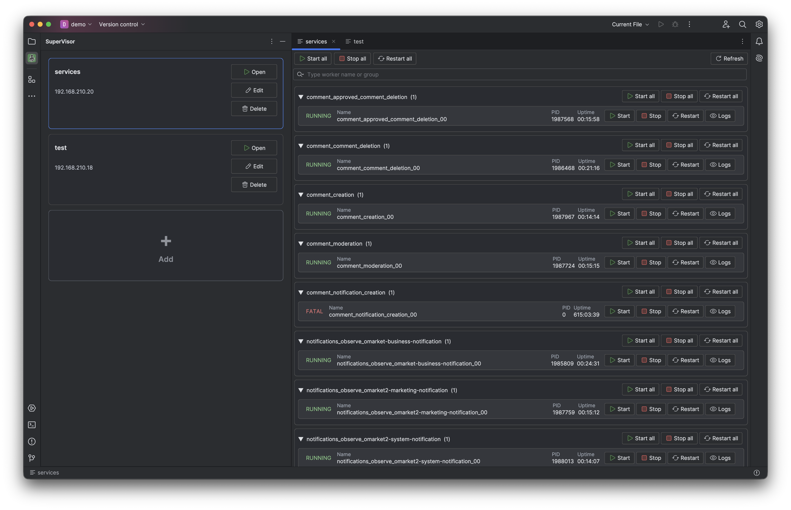
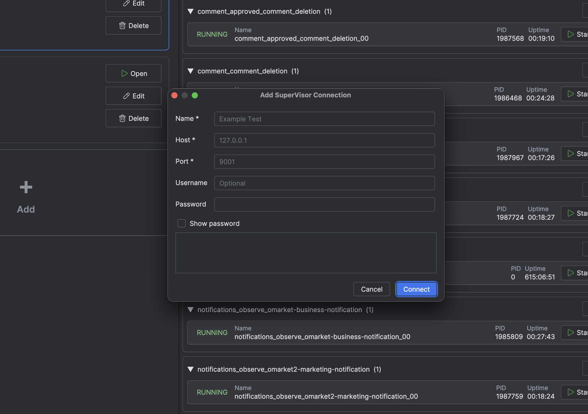
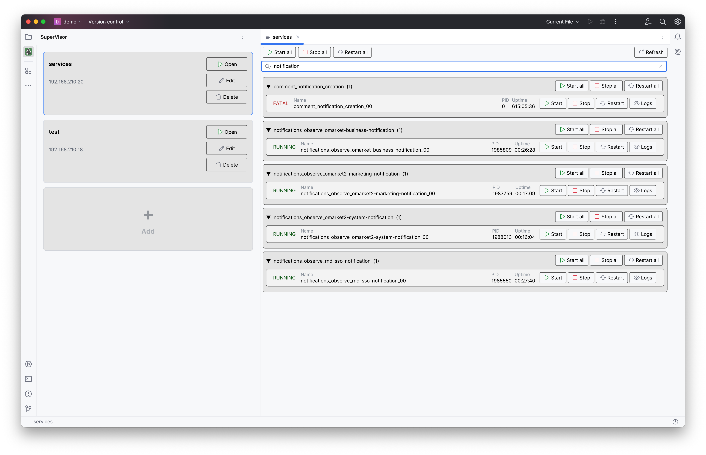
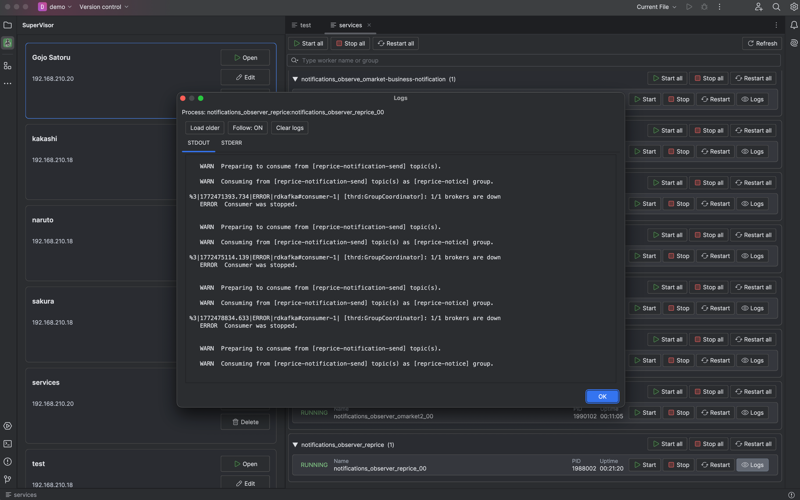

# SuperVisor Plugin

SuperVisor is a JetBrains IDE plugin for managing Linux Supervisor processes without leaving the editor.

## Overview

SuperVisor connects to your Supervisor XML-RPC endpoint and gives you a single UI to monitor workers, run actions, and inspect logs.

## Features

- Multiple Supervisor connections in one tool window
- Process list grouped by worker group with search/filter flow
- One-click actions: start, stop, restart (including bulk/group flows)
- STDOUT and STDERR log viewer with live tail and older chunk loading
- Clear logs and copy worker metadata from context actions

## Usage Flow

1. Open `SuperVisor` tool window in your JetBrains IDE.
2. Add a connection (`host`, `port`, optional `username/password`).
3. Select a process and run actions (`start`, `stop`, `restart`).
4. Open logs in tabs and follow output in real time.

## Configuration

- `processRefreshIntervalSec` (default: `5`)
- `logPollingIntervalSec` (default: `2`)
- `maxLogBufferChars` (default: `200000`)
- `autoOpenEditorOnDoubleClick` (default: `true`)

Credentials are stored locally via JetBrains Password Safe.

## Screenshots

### Connection and Process Overview

### Process and Incident Details

### Actions and Workflow

### Operational Control

## Documentation

- [Docs (Live)](https://get-supervisor.netlify.app/docs)
- [Local Docs Page](../docs.html)

## Support

- `goldentap.kz@gmail.com`

## Legal

- [EULA](./EULA.md)
- [Privacy Policy](./PRIVACY_POLICY.md)
